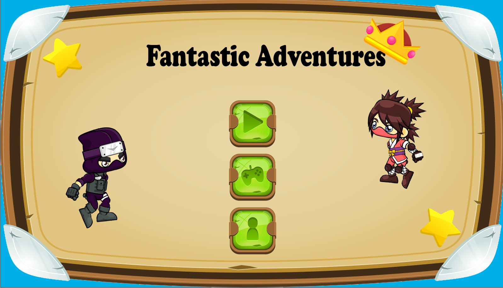
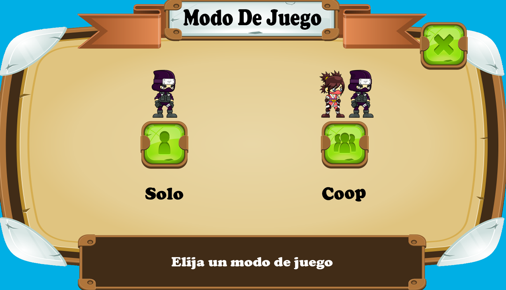
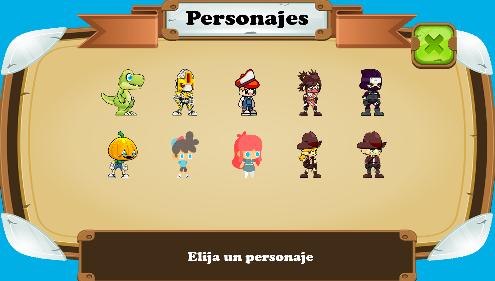
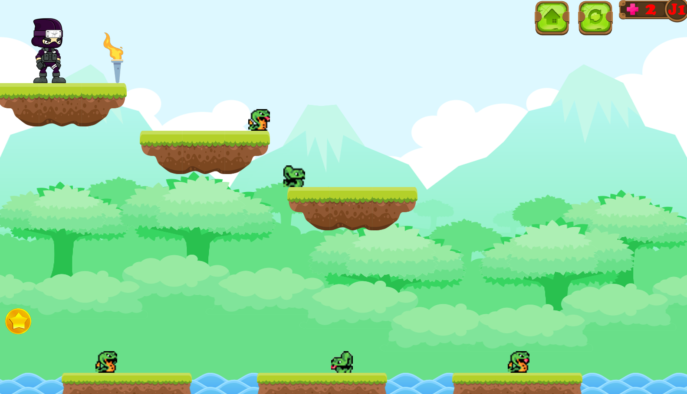
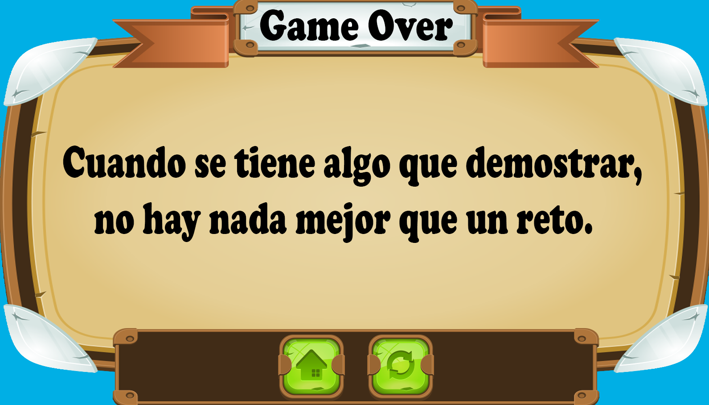

# Factastic Adventures

🎮 **Descripción del proyecto**  
Este proyecto fue desarrollado usando [Greenfoot](https://www.greenfoot.org/), una plataforma de desarrollo educativo basada en Java. Este proyecto tiene como fin aprender de forma didactica la programación orientada a objetos.

📌 **Características principales**
- Programado en Java usando Greenfoot
- Interacción mediante teclado, mouse y/o control
- Tipo de juego: plataforma (Solo/Coop)
- Personajes con habilidades y caracteristicas especiales

📷 **Capturas del juego**
- Menu principal

- Menu modo (Solo/Coop)

- Menu Personajes

- Juego

- Menu GameOver

▶️ **Trailer**  

🛠️ **Requisitos para ejecutar el proyecto**
- Descargar o clonar este repositorio
- Extraer el contenido de las partes en formato `.rar`  (dejará un archivo gfar)
- Tener instalado [Greenfoot](https://www.greenfoot.org/download)
- Abrir el archivo `.gfar` con Greenfoot

👨‍💻 **Autor**
- Jeison Alexis Rodiguez Angarita 🙍‍♂️
- Programacion Orientada a Objetos / Ingeniería de Sistemas / Universidad de Pamplona 👨‍🎓
- 2024 🌎
